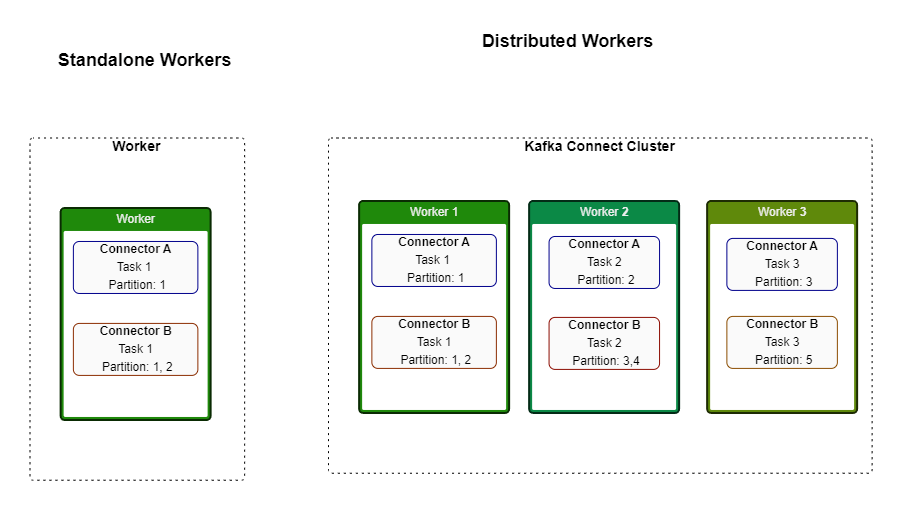
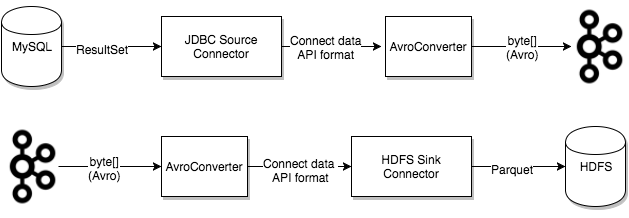

# poc-kafka-connect-worker

## Kafka Connect

    - "Kafka Connect é um componente gratuito e open-source do Apache Kafka que trabalha com hub de dados, centralizando para integrações simples entre banco de dados, key-value stores, search indexes e file systems"

    - link documentation: https://docs.confluent.io/platform/current/connect/index.html

## Kafka Converters

    - "As tasks utilizam os 'converters' para mudar o formato dos dados tanto para leitura ou escrita no kafka"

    - Documentation Converters: https://docs.confluent.io/platform/current/connect/index.html#connect-converters

    - Formatos de dados aceitos pelo kafka para converter

        - AvroConverter
        - ProtobufConverter
        - JsonSchemaConverter
        - JsonConverter
        - StringConverter
        - ByteArrayConverter

## Kafka DLQ - Deat Letter Queue

    - Documentation Deat Letter Queue: https://docs.confluent.io/platform/current/connect/index.html#dead-letter-queue

    - "Quando há um registro inválido, independente da razão, o erro pode ser tratado nas configurações do conector através da propriedade "erros.tolerance". Esse tipo de configuração pode ser realizado apenas para conectores do tipo 'Skin'".

    - Existem dois valores válidos para errors.tolerance:

        - none( padrão ) - Faz a tarefa falhar imediatamente. Deve ser consultado os logs para entender o problema ocorrido.
        - all - Erros são ignorados e o processo continua normalmente.

    - Criar um Topico da fila para as Deat Letter Queue

        - Assim os sistema não se compromete em parar, ele armazena os dados nessa fila com as mensagens de erro.
        - Os erro são informados no header da mensagem.
        - Assim fica mais estrategico para recuperar as mensagens.

        - errors.tolerance = all
        - errors.deadletterqueue.topic.name = <dead-letter-topic-name>
